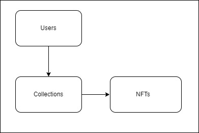
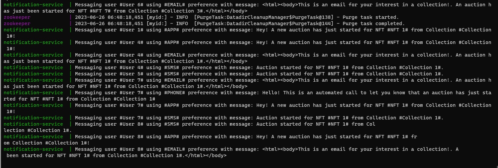
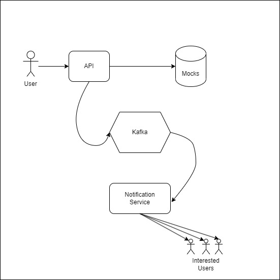

# nft-auction

An event-driven nft-auction test case. Using event-driven architecture powered by Kafka and NodeJS. All data is mocked to give more emphasis to the communication between services using message queues.

# Approach

This project had a timeframe of roughly 4h, and given the limited timeframe a few assumptions were made from the beginning:

1. The core and most important part: test the communication between two isolated services using Kafka. This should be done using the bare minimuns required to avoid over engineering a small test case;
2. Ensure that everything can be ran in any machine by using docker to start up the services, including Kafka;
3. Build a simple API, the producer, to trigger the auction and send the required data involving: users, nft, related collections and notification preferences;
4. Build a simple service, the consumer, to consume the messages from Kafka and imitate a notification service, being capable of delivering different messages formats to different technologies, such as SMS, Email or Phone calls;

# Assumptions

A few assumptions were followed to establish outer walls through which the scope should not run from. This is basically the scope in which this test case was built:

* No database is required, making all used data be mocked data;
* There's only one endpoint, `/create-auction/:id`, which triggers all the process;
* Kafka offers several custom configurations, like retries, acknowlegements, partitions to be used or batch posts/reads. This test case is using the default configurations for all options;
* The actual notification delivery should not be implemented;
* As data is mocked, the mocks are built in a way to facilitate fetching, but also split into their own domains;

# Trade-offs

A few paths were taken given the scope of the project, resulting in trade-offs that can raise some quite cool discussions:

1. Kafka was chosen given my past experience with it and the fact that not long ago I did a quick test using the same server to produce and consume messages, meaning I had an ideia of how to set it up. However, it does look like a big tool for such a small test case;
2. OOP was in the requirements, and when it comes to NodeJS and OOP one of the main options is Nest.JS. I do have experience with it, however configuring it could be tricky, mainly when throwing Kafka into the scene. For this reason I decided to create classes using TypeScript only without the aid of any other framework or libs;
3. The notification-service splits the logic of all notification technologies into different classes, meaning that each used technology has its own class with its own methods. It also means that for each new technology a new class would be required, which initially sounds like a high maintenance code. However, splitting this logic into multiple classes gives us the freedom of treating each one of them the way we prefer, which takes away the high effort of maintaining one big generic solution while opening the doors for any other future technology, without touching or changing the existing ones;
4. As mentioned on the assumptions, all Kafka options are set to default. We could make use of batches or a more tailored solution for partitions, however, going for the default options saves up time of set up and how  data is handled for consumption, which helps making sure that the given schedule is followed;

# Running the test case

It is required to have docker running in your machine, then you can run:

`docker compose up`

This should start Kafka, the Api and the Notification Service. Make sure to keep an eye in the logs to wait until everything is started, but also to see the logs from each notification sent.

Now head to `localhost:333/create-auction/:id` and replace `id` with any ID found in the [Nfts mock file](api/src/nfts/NftMocks.ts), and then the logs should show each notification being sent.

# How it works

The app consists of Nfts, Collections and Users, where auctions are only the triggers to all the processes.



*Users can have interest in one or multiple collections -> Collections can have one or multiple NFTs -> NFTs are listed as part of a collection.*

When the `/create-auction` endpoint is hit with a valid NFT ID, a process is started consisting of looking for which Collection this NFT is part of and which users have interest in them. Then for each user with interest in this NFT a message is created consisting of user, collection and NFT information.

```
NotificationDataInterface {
  nft: { id: string, name: string },
  collection: { name: string },
  user: { name: string, notificationPreferences: string[] }
}
```

A message like this is created for each user and then sent over to Kafka, that then later on the Notification Service consumes. Once the message is cosumed the service checks for the notification preferences found in the message and uses that information to decide how to build the notification message and how to send that message. Each notification preference produces a different notification message that can be seen in the logs from Kafka.



Which concludes the process of *hitting the API -> working with the data -> producing messages -> consuming each message -> processing each message accordingly*.



##### Possible issues

- Docker is not set to build the application and then start, `sucrase` and `nodemon` are used instead, the first `docker compose up` may take a while.
